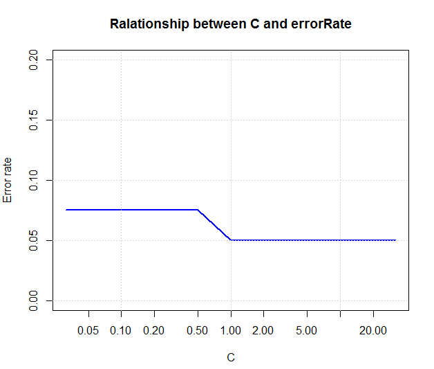

[](http://quantlet.de/index.php?p=info)

## [](http://quantlet.de/) **FaceRecognition_SVM** [](http://quantlet.de/d3/ia)

```yaml

Name of Quantlet : FaceRecognition_SVM

Published in : unpublished

Description : 'Classifies if a greyscale picture belongs to a particular person by using Support
Vector Machines as classification algorithm.'

Keywords : SVM, classification, face-recognition, support-vector-machines, supervised-learning

See also : PCA

Author : Xiaofei Xu, Janice Paschek

Submitted : Sunday, August 21 2016 by Janice Paschek

Datafile : newfaces1.txt

Input : 'Datafile consists of pixel matrix of 400 pictures belonging to 10 persons. The dimension
for the images should be reduced by PCA.'

```




### R Code:
```r
# required packages
library(kernlab)
library(e1071)
library(gmodels)

# read in the data after doing dimension reduction
faces = read.table("newfaces1.txt")

# split the data in test and trainings set (first nine pictures = train, last picture = test)
id = rep(1:40, each = 10)
faces.data.frame = data.frame(cbind(id = id, faces))

testid = seq(10, 400, by = 10)
train.faces = faces.data.frame[-testid, ]
test.faces = faces.data.frame[testid, ]

# SVM model
svm.model = ksvm(id ~ ., data = train.faces, type = "C-svc", kernel = "vanilladot", C = 10, drop = FALSE)

# prediction
svm.prediction = predict(svm.model, test.faces)

# accuracy measurement
CL = faces.data.frame$id[testid]
sum(svm.prediction != CL)/length(svm.prediction)

# cross table
crosstable.svm = CrossTable(x = svm.prediction[1:10], y = CL[1:10], prop.chisq = FALSE)

# calculation of running time
ptm = proc.time()
svm = ksvm(id ~ ., data = train.faces, type = "C-svc", kernel = "vanilladot", C = 10, drop = FALSE)
proc.time() - ptm
 

```
